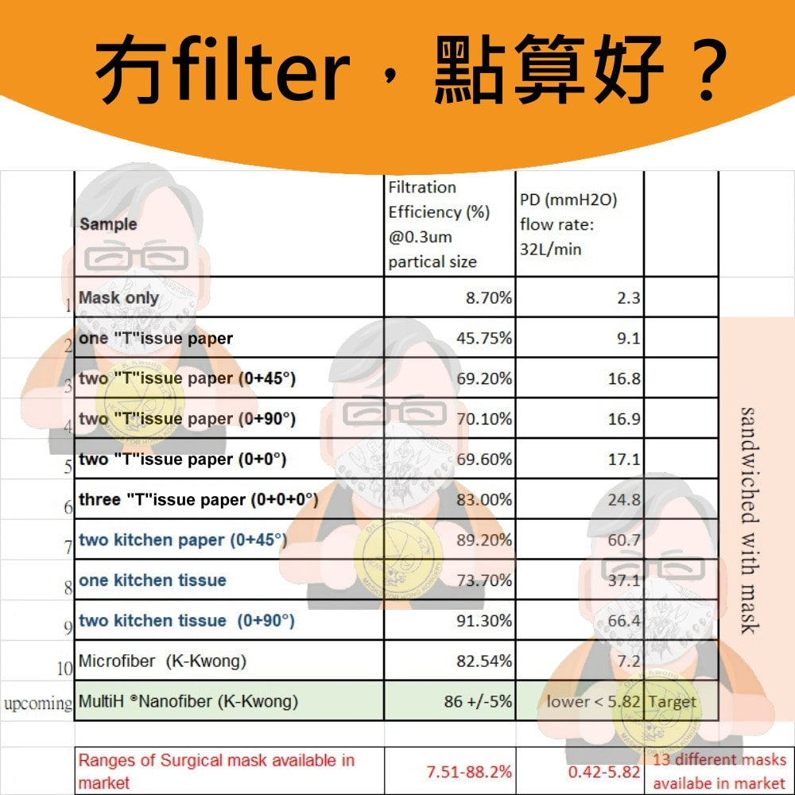
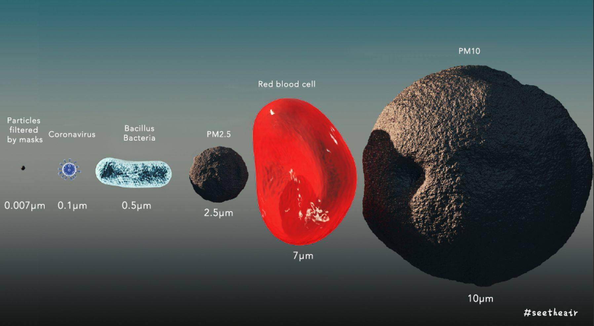
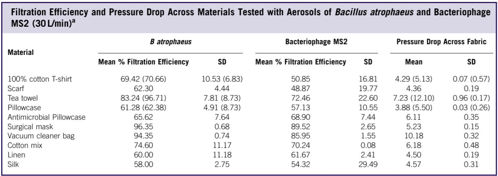

# Ventilator Virus Filter

This is an open source hardware project focused on making an in line ventilator housing to add virus filters such as N95 or P100 filter pads.

The project is motivated to help protect people living with ALS who are high risk for virus/COVID because they are breathing compromised.  The idea is to reduce the probability of an airborne virus making its way through their ventilator and into their lungs by inserting an inline filter of N95 or higher quality into their pneumatic tube.

The idea is similar to the bacterial filters that are on the market today that are designed to reduce bacterial spread between shared ventilator users.  The difference is that this filter design will use off the shelf respirator filters from face masks and will use commonly available hardware plus a 3D printed enclosure to make it easy to quickly source during this time of worldwide epidemic.

## Tube Connection Specifications

Image source: https://www.gearbest.com/sleeping-aids/pp_3003173012343574.html

## Filtration Medium

### P100 Mask Filter from 3M

110 mm Outer Diameter

Image source: https://www.3m.com/3M/en_US/company-us/all-3m-products/~/3M-Particulate-Filter-2097-07184-AAD-P100-with-Nuisance-Level-Organic-Vapor-Relief-100-EA-Case/?N=5002385+3294780246&rt=rud

### Microfiber Cleaning Cloths

Image source: https://www.facebook.com/photo/?fbid=10157887204312158&set=a.10157616487867158

https://diymask.site/

https://www.amazon.com/Microfiber-Cleaning-Cloths-Spectacles-Silverware/dp/B07V8299LG

### Saline soaked and dried for improved filtration

Why: [Universal and Reusable Virus Deactivation System for Repiratory Protection](static/UniversalAndReusableVirusDeactivationSystemForRespiratoryProtection.pdf)

Saline Soaking Preparation Procedure ([PDF Capture](static/SalineSoakingProcedureAndReferences))
Source: https://www.facebook.com/MrHenryBemis/posts/10159579527538858

### Reasoning for N95 filters

### Studies in filtration material

[Best DIY Filters](static/BestDIYFilters.pdf)

[Testing The Efficacy of Homemade Masks](static/TestingTheEfficacyOfHomemadeMasks.pdf)

## Initial Prototypes

### Initial Bill Of Materials

* 120 mm ID O-Ring (seal around filter for assembled upper & lower housing), [McMaster P/N 9262K881](https://www.mcmaster.com/9262k881)
* M4 x 0.7 mm, 12 mm long Philips head screws, [McMaster P/N 91294A192](https://www.mcmaster.com/91294a192)
* M4 x 0.4 mm, Nylon Locknuts, [McMaster P/N 90576A103](https://www.mcmaster.com/90576a103)
* 3M P100 Filters, 4.3" OD, [3M 2097](https://www.3m.com/3M/en_US/company-us/all-3m-products/~/3M-Particulate-Filter-2097-07184-AAD-P100-with-Nuisance-Level-Organic-Vapor-Relief-100-EA-Case/?N=5002385+3294780246&rt=rud)
* Upper & Lower 3D printed housing (TBD)
* XTC 3D Resin Coating for 3D prints (sealant), [XTC 3D](https://www.smooth-on.com/products/xtc-3d/)

## Existing Ventilator Filters (not N95 compliant)

#### Philips Respironics Disposable Bacterial Filter

https://www.usa.philips.com/healthcare/product/HC342077/bacteria-filter-filter

#### Moyeah CPAP Bacterial Viral Filter

https://www.gearbest.com/sleeping-aids/pp_3003173012343574.html