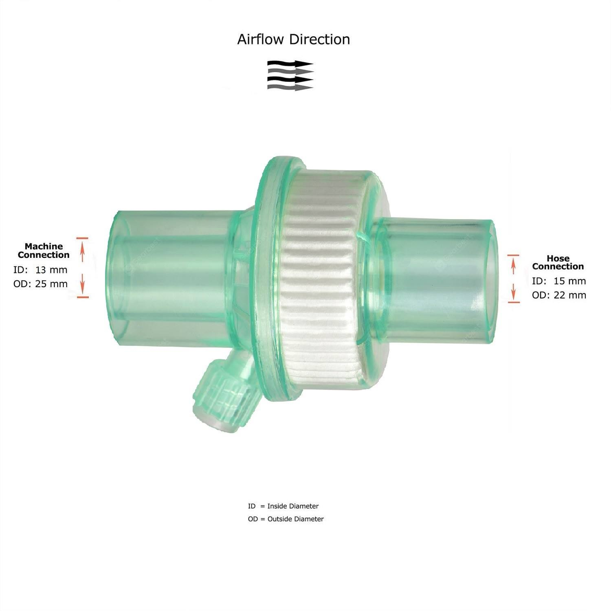
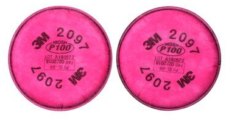
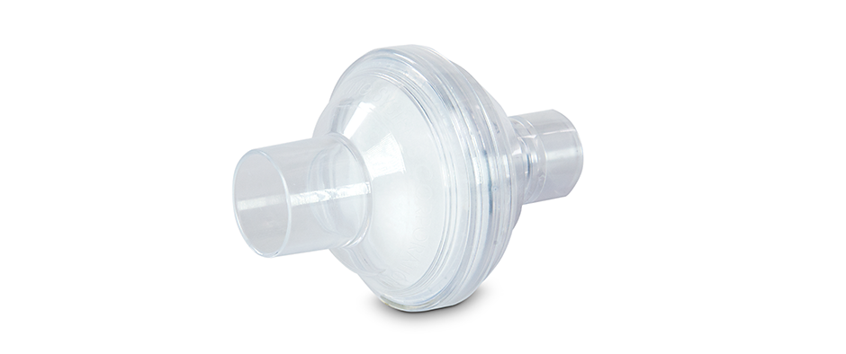
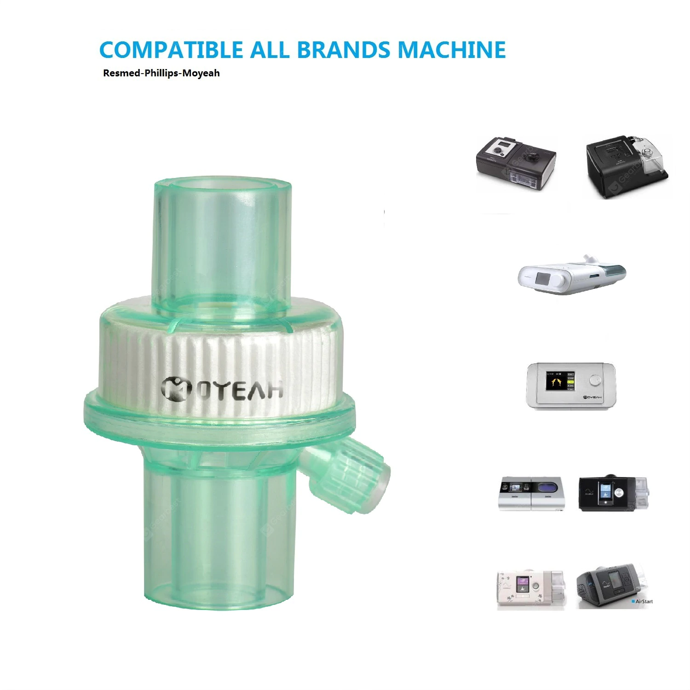

# Ventilator Virus Filter

This is an open source hardware project focused on making an in line ventilator housing to add virus filters such as N95 or P100 filter pads.

The project is motivated to help protect people living with ALS who are high risk for virus/COVID because they are breathing compromised.  The idea is to reduce the probability of an airborne virus making its way through their ventilator and into their lungs by inserting an inline filter of N95 or higher quality into their pneumatic tube.

The idea is similar to the bacterial filters that are on the market today that are designed to reduce bacterial spread between shared ventilator users.  The difference is that this filter design will use off the shelf respirator filters from face masks and will use commonly available hardware plus a 3D printed enclosure to make it easy to quickly source during this time of worldwide epidemic.

## Tube Connection Specifications

Image source: https://www.gearbest.com/sleeping-aids/pp_3003173012343574.html

## Filtration Medium

Image source: https://www.3m.com/3M/en_US/company-us/all-3m-products/~/3M-Particulate-Filter-2097-07184-AAD-P100-with-Nuisance-Level-Organic-Vapor-Relief-100-EA-Case/?N=5002385+3294780246&rt=rud

## Initial Prototypes

## Existing Ventilator Filters (not N95 compliant)

#### Philips Respironics Disposable Bacterial Filter

https://www.usa.philips.com/healthcare/product/HC342077/bacteria-filter-filter

#### Moyeah CPAP Bacterial Viral Filter

https://www.gearbest.com/sleeping-aids/pp_3003173012343574.html